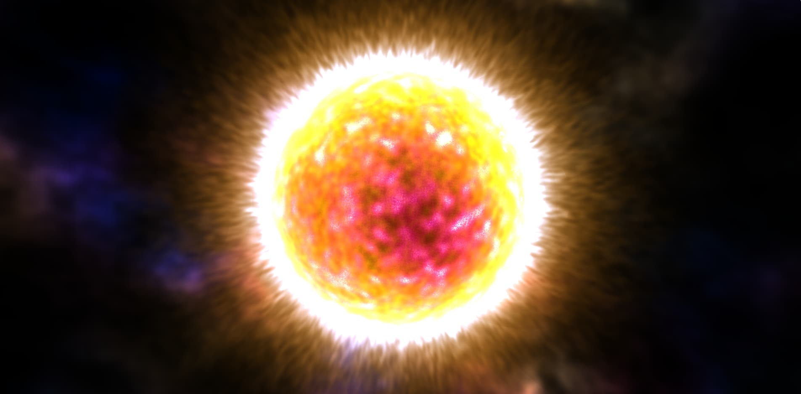

<div>

#  Sun Shader

### Procedural star rendering in real-time WebGL

A faithful port of [Panteleymonov's procedural sun shader](https://www.shadertoy.com/view/XlXGzS) from Shadertoy to a standalone HTML/WebGL application with Three.js orbit controls.


</div>

---

## Overview

This project renders a **fully procedural animated sun** — no textures, no pre-computed maps, no external assets. Every pixel is calculated in real-time through the fragment shader using layered 4D noise, ray-sphere intersections, and multi-octave noise compositing.

The result is a living, breathing star surface with dynamic corona rays, glow rings, and subtle chromatic variations — all running at 60 fps in a single HTML file.

---

## Features

| Feature | Description |
|---|---|
| **Procedural surface** | 4D noise (`noise4q`) generates organic, animated solar granulation |
| **Multi-octave detail** | 3-layer noise compositing at different scales for surface depth |
| **Corona rays** | Noise-modulated ray casting with distance-based attenuation |
| **Glow ring** | Soft Fresnel-like ring around the solar limb |
| **Space noise** | Background nebula-like color variation behind the star |
| **Orbit controls** | Three.js OrbitControls for intuitive mouse-driven rotation |
| **Responsive** | Adapts to any window size, HiDPI-aware pixel ratio |
| **Zero dependencies** | Single self-contained HTML file, no build step |

---

## Quick Start

```
1. Download  →  sun.html
2. Open it   →  Double-click or drag into any modern browser
3. Interact  →  Click and drag to rotate the view
```

That's it. No server, no install, no build tools.

---

## Architecture

```
sun.html
├── Import Map          Three.js + OrbitControls via CDN
├── Renderer            WebGLRenderer with HiDPI support
├── Camera              PerspectiveCamera at (0, 0, 5)
├── Controls            OrbitControls (rotate only, no zoom/pan)
├── Shader Material
│   ├── Vertex          Full-screen quad (clip-space passthrough)
│   └── Fragment        Procedural sun raymarcher
└── Animation Loop      Clock-driven uniform updates + render
```

### Shader Pipeline

The fragment shader follows a layered compositing approach:

```
  Ray-Sphere Intersection
          │
          ▼
  ┌───────────────────┐
  │  Surface Noise     │  noiseSpere() × 2 passes (coarse + fine)
  │  (s1, s2)          │  → base color: yellow-white gradient
  └────────┬──────────┘  → detail color: red-magenta highlight
           │
           ▼
  ┌───────────────────┐
  │  Limb Darkening    │  ring() → soft edge subtraction
  └────────┬──────────┘
           │
           ▼
  ┌───────────────────┐
  │  Corona Rays       │  ringRayNoise() → noise-modulated rays
  └────────┬──────────┘
           │
           ▼
  ┌───────────────────┐
  │  Background Space  │  noiseSpace() → colored nebula behind star
  └────────┬──────────┘
           │
           ▼
      Output Color
```

---

## Shader Functions

| Function | Purpose |
|---|---|
| `hash4(vec4)` | Deterministic pseudo-random vector generator |
| `noise4q(vec4)` | 4D simplex-like noise with smooth interpolation |
| `noiseSpere(...)` | Multi-octave spherical noise projection for the star body |
| `ring(...)` | Radial distance-based glow ring |
| `ringRayNoise(...)` | Noise-driven ray casting with angular modulation |
| `noiseSpace(...)` | Background volumetric noise for space atmosphere |
| `sphereZero(...)` | Visibility test: inside vs. outside the sphere |

---

## Controls

| Input | Action |
|---|---|
| **Left drag** | Rotate view around the sun |
| **Scroll** | Disabled (shader is full-screen) |
| **Right drag** | Disabled (pan not needed) |

> OrbitControls is configured with damping enabled (`factor: 0.05`) for smooth, fluid rotation.

---

## Performance Notes

- The shader runs **per-pixel** on the GPU — CPU is only used for uniform updates
- `noiseSpere()` is the most expensive function (3-octave loop with ray intersection)
- `noise4q()` uses branchless hash mixing for consistent GPU performance
- No texture sampling — entirely **ALU-bound** shader

---

## Credits

**Original shader** — [Panteleymonov Aleksandr (2015–2016)](mailto:foxes@bk.ru)
[Space/Star/Sun](https://www.shadertoy.com/view/XlXGzS) on Shadertoy

**Three.js** — [threejs.org](https://threejs.org/)

---

## License

This project is released under the [MIT License](LICENSE).

```
Permission is hereby granted, free of charge, to any person obtaining a copy
of this software and associated documentation files.
```

---

<div align="center">

*Built with GPU mathematics and procedural generation.*
*No textures were harmed in the making of this sun.*

</br>

Made with ❤️ by <a href="https://sebas-dev.vercel.app/" target="_blank" rel="noopener noreferrer">Sebastián V</a>


</div>
